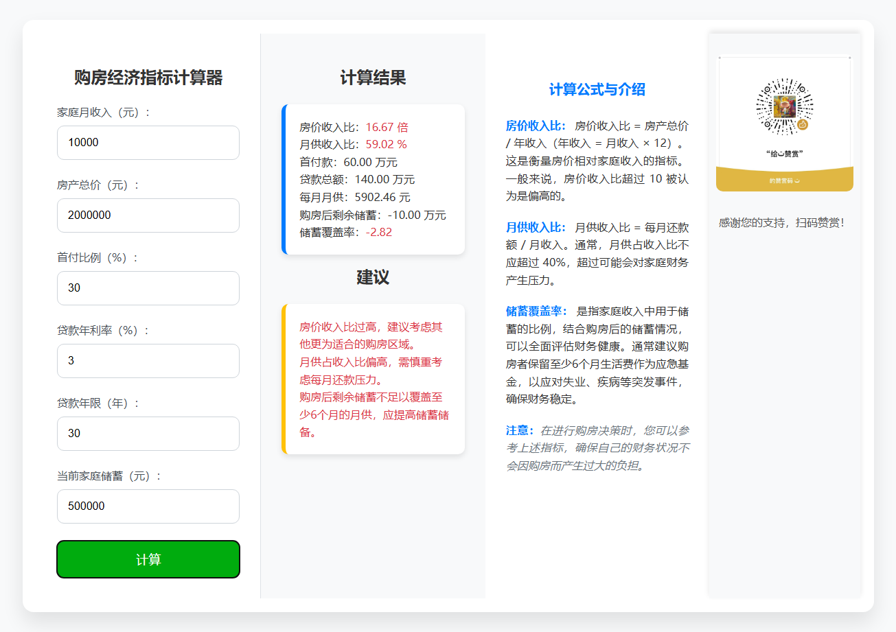

# 购房经济指标计算器

## 概述
购房经济指标计算器是一个简单的网页应用程序，帮助用户评估购房的经济可行性。通过输入家庭月收入、房产总价、首付比例、贷款年利率、贷款年限和当前家庭储蓄，用户可以计算出房价收入比、月供收入比和储蓄覆盖率，并获得相应的购房建议。

## 功能
- 计算房价收入比
- 计算月供收入比
- 计算购房后的剩余储蓄和储蓄覆盖率
- 提供购房建议

## 界面

## 使用方法
1. 打开 https://house-calculator-dusky.vercel.app/
2. 在表单中输入相应的数值：
   - 家庭月收入（元）
   - 房产总价（元）
   - 首付比例（%）
   - 贷款年利率（%）
   - 贷款年限（年）
   - 当前家庭储蓄（元）
3. 点击“计算”按钮。
4. 查看计算结果和建议。

## 计算公式与介绍
- **房价收入比**：房价收入比 = 房产总价 / 年收入（年收入 = 月收入 × 12）。房价收入比超过 10 被认为是偏高的。
- **月供收入比**：月供收入比 = 每月还款额 / 月收入。月供占收入比不应超过 40%，超过可能会对家庭财务产生压力。
- **储蓄覆盖率**：是指家庭收入中用于储蓄的比例，结合购房后的储蓄情况，可以全面评估财务健康。建议购房者保留至少6个月生活费作为应急基金，以应对失业、疾病等突发事件，确保财务稳定。

## 注意事项
在进行购房决策时，您可以参考上述指标，确保自己的财务状况不会因购房而产生过大的负担。
