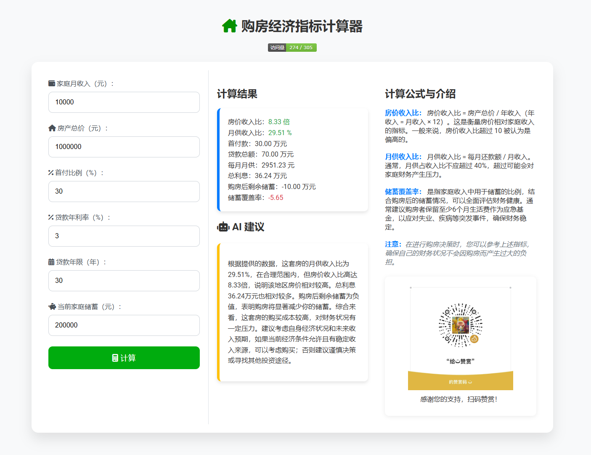

# 购房经济指标计算器

## 概述
购房经济指标计算器是一个网页应用程序，帮助用户评估购房的经济可行性。通过输入家庭月收入、房产总价、首付比例、贷款年利率、贷款年限和当前家庭储蓄，用户可以计算出房价收入比、月供收入比和储蓄覆盖率，并获得 AI 智能购房建议。

## 功能
- 计算房价收入比
- 计算月供收入比
- 计算购房后的剩余储蓄和储蓄覆盖率
- 🤖 AI 智能购房建议（基于 MiniMax 大模型）

## 界面


## 项目结构
```
house_calculator/
├── public/                    # 静态资源（由 Vercel 托管）
│   ├── index.html             # 页面结构
│   ├── styles.css             # 样式表
│   ├── script.js              # 前端逻辑（不含 API Key）
│   ├── favicon.ico            # 网站图标
│   └── appreciate.jpg         # 赞赏码
├── api/                       # Vercel Serverless Functions
│   └── chat.js                # MiniMax AI 代理接口
├── vercel.json                # Vercel 配置
├── package.json               # 项目配置
├── .env.local                 # 本地环境变量（不提交）
└── .gitignore                 # Git 忽略规则
```

## 部署指南

### 环境变量
在 Vercel Dashboard → Settings → Environment Variables 中添加：

| 变量名 | 说明 |
|--------|------|
| `MINIMAX_API_KEY` | MiniMax AI 平台的 API Key |

### 部署步骤
1. Fork 或 clone 本仓库
2. 在 [Vercel](https://vercel.com) 中导入项目
3. 配置环境变量 `MINIMAX_API_KEY`
4. 部署即可

### 本地开发
```bash
# 安装 Vercel CLI
npm i -g vercel

# 创建 .env.local 文件并设置 MINIMAX_API_KEY
echo "MINIMAX_API_KEY=your_api_key_here" > .env.local

# 启动本地开发服务器
vercel dev
```

## 使用方法
1. 打开网站
2. 在表单中输入相应的数值：
   - 家庭月收入（元）
   - 房产总价（元）
   - 首付比例（%）
   - 贷款年利率（%）
   - 贷款年限（年）
   - 当前家庭储蓄（元）
3. 点击"开始计算"按钮
4. 查看计算结果和 AI 购房建议

## 计算公式与介绍
- **房价收入比**：房价收入比 = 房产总价 / 年收入（年收入 = 月收入 × 12）。房价收入比超过 10 被认为是偏高的。
- **月供收入比**：月供收入比 = 每月还款额 / 月收入。月供占收入比不应超过 40%，超过可能会对家庭财务产生压力。
- **储蓄覆盖率**：购房后剩余储蓄能覆盖多少个 6 个月月供周期。建议购房者保留至少 6 个月生活费作为应急基金。

## 安全说明
- API Key 通过环境变量存储在服务端，前端代码中不包含任何密钥信息
- 所有 AI 请求通过 `/api/chat` 后端代理转发

## 注意事项
在进行购房决策时，您可以参考上述指标，确保自己的财务状况不会因购房而产生过大的负担。
